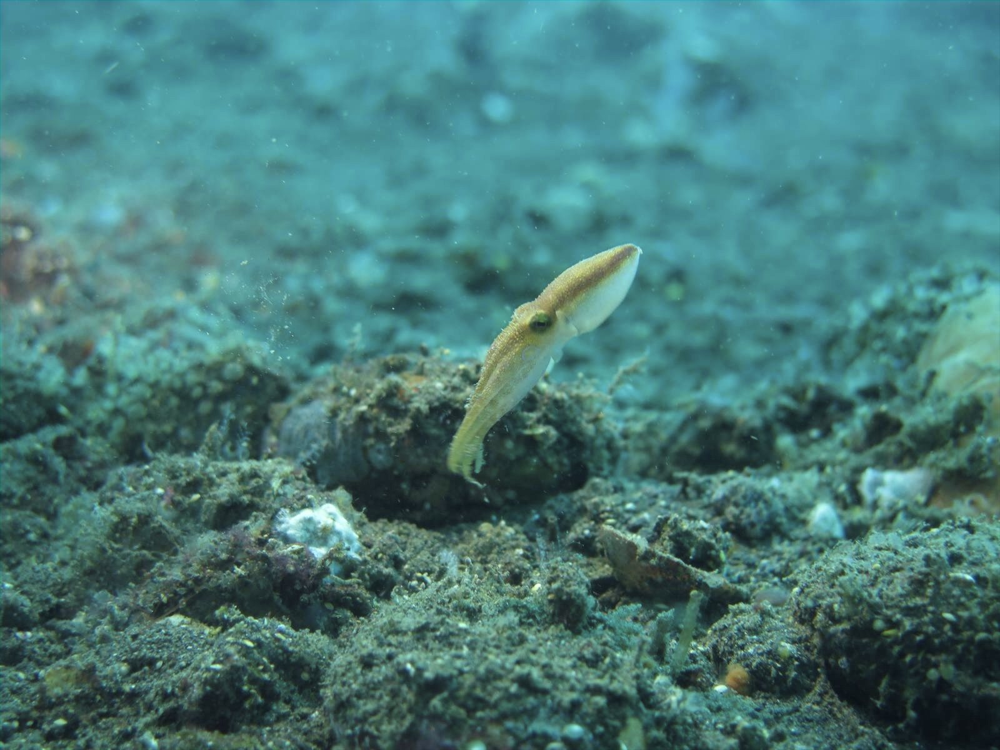
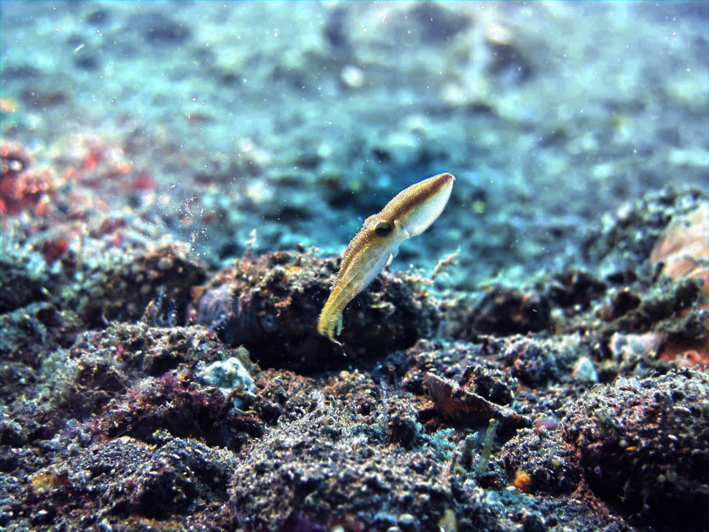
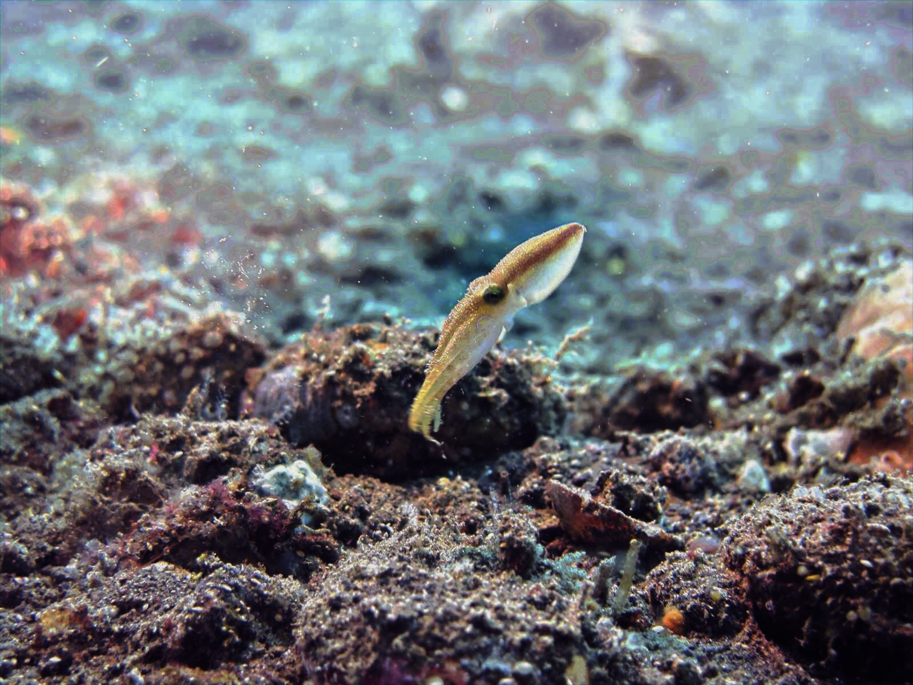

# Underwater image colour correction and enhancement using retinex methods 

Images captured under water, for various applications including ocean exploration, are heavily degraded due to low visibility and scattering. This causes the red channel to attenuate and the image losing overall illumination. The degradation is more pronounced as the depth of exploration is increased. This project aims at replicating and implementing a color correction algorithm described in a publication that claims to give the best performance of all the algorithms they tested alongside their own. The algorithm cleverly relies on the property of the cameras using Color Filter Array (CFA) to capture images in RGB space that the 3 channels obtained for each pixel are dependent and coupled because of the interpolation process. The reason and the origin of this phenomenon is discussed in detail in the methodologies. This dependence is used to compensate the attenuated red channels of the image. Further enhancement is carried out for improved illumination across the image using a Retinex model. 
The contrast of the degraded image is improved using a piecewise linear adaptive histogram equalisation, thus obtaining a much better image overall. The project finally concludes by testing the various metrics of performance on the implementation over various images. The complete credit for the algorithm goes to the original publication and this project is just an attempted implementation.\\

In this project, we were able to implement the underwater image colour correction algorithm presented in the principle publication satisfactorily. The algorithm captures step wise enhancement techniques starting from the raw underwater image. The colour correction and enhancement mean bringing the colour of the objects in the image to their original form if they were on the surface instead of under water, where the effects of red channel attenuation and scattering are dominant resulting in captured images being saturated in blue/green tinge with a lot of unwanted haze. The colour correction restores back the colours of elements using the properties of the CFA used to capture images. While the enhancement is required to restore the contrast lost due to scattering and the illumination due to low light under water. This correction and enhancement is required for more effective analysis of the images in general, that allow other image processing techniques to be successful on these images just as well as they are on normal images. This provides for improved inferences from underwater images taken for research, diagnosis or exploratory purposes.\

The previous work presented in the publication have tried to address the enhancement of underwater images in detail but the results obtained thereof have not been satisfactory or not suitable in general. In some cases, either the red channel oversaturates leading to red coloured artifacts, essentially degrading the image further, while in some cases the improvements are not visible, hence defeating the purpose. The implementation was tested on various underwater images and it has been able to provide satisfactory enhancements consistently.

The main motivation for undertaking this project was to understand and implement actually useful image processing techniques for coloured images that were, previously, unexperienced. The original publication, however, had missing details regarding the retinex enhancement technique, that allowed us to delve into its details and pre-process the raw images correctly before actually using them as input. During the course of the implementation, it was extremely vital to understand, in detail, the requirements and results of each of the steps along with the intermediate data types being used to do the different kinds of processing. Figuring out the suitable compatibility of the steps' outputs and inputs was time consuming and at the same instant,  pivotal in the successful implementation of the algorithm.
The implementation requires certain parameters that will depend on the image at hand. An example of this is the $\alpha$ parameter of the red channel compensation which will vary with images depending on the green or blue channel contributions in the original image. The further scope of this project includes extending the current implementation for automating tuning of these parameters. The algorithm consumes a considerable time for retinex computation on a single image. This provides ground for improvement of the computational efficiency as well.

### Stage-wise results obtained
Raw image

Red-channel compensation

White balancing

Retinex for improving illumination

Histogram Equalization

Disclaimer:
This is an implementation of this orginal paper: https://github.com/MRK4863/Underwater-image-colour-colrrection-and-enhancement--using-retinex-methods-/blob/main/READING_AND_REFERENCE_MATERIALS/BASE_PAPER.pdf
